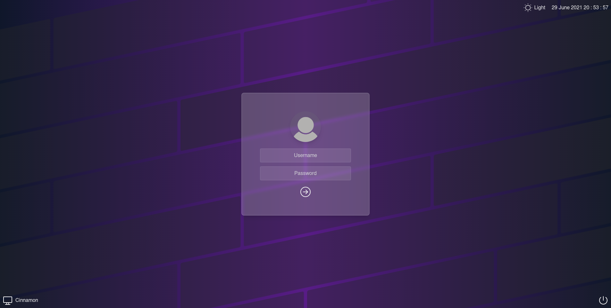
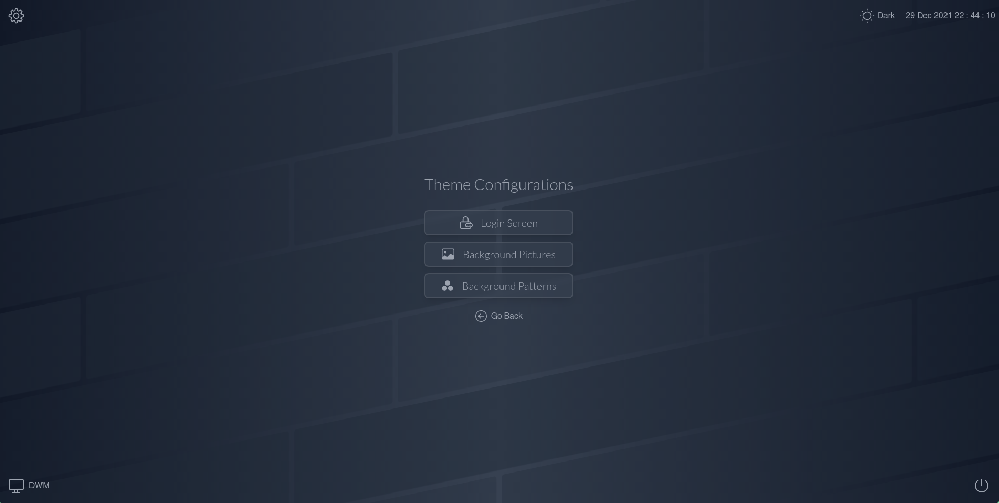
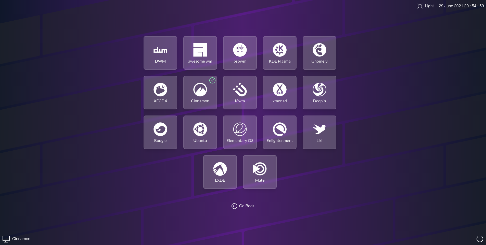
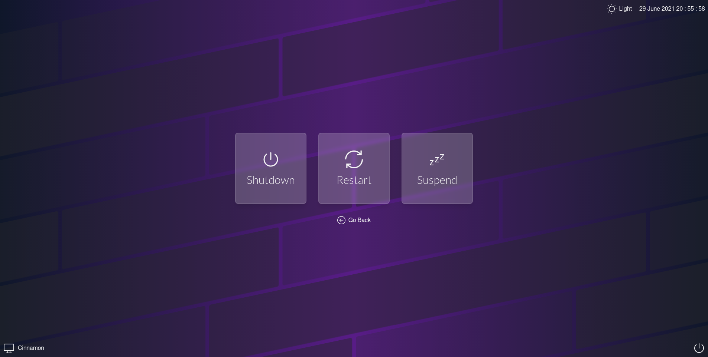
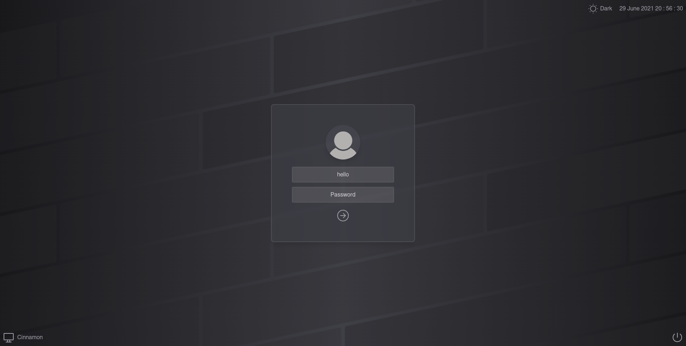
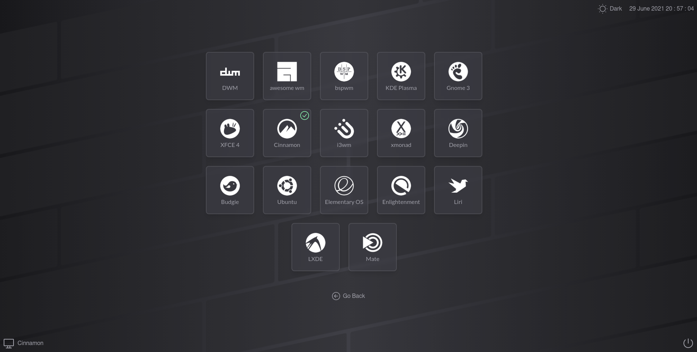
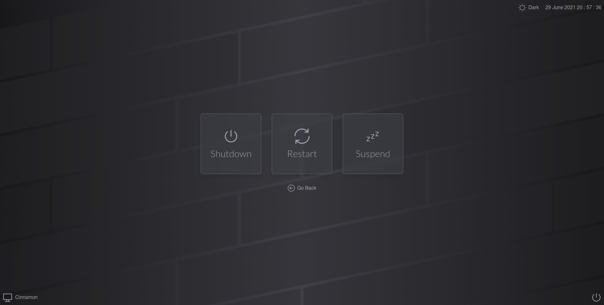

# Reactive - A LightDM Webkit2 Greeter theme

Fast, Modern and simple theme for lightdm webkit2 greeter written in Svelte javascript frontend framework for less bloat.

[](https://github.com/gitneeraj/lightdm-webkit2-theme-reactive/actions/workflows/build.yml)

## Live Demo

Check out the theme in action [here](https://gitneeraj.github.io/lightdm-webkit2-theme-reactive/)

## Screenshots










## Features

- Simple login screen
- Choose desktop environment/Window Manager to login
- Power options to shutdown, restart & suspend
- Choose for DARK or LIGHT theme
- Change background images (defaults to `/usr/share/backgrounds` location)
- Change login box placement and its style (with or without card)
- TODO: customize profile pictures
- TODO: customize colors 
- Have any cool feature? Sure, let me know on reddit @unkowncoder

## Installation

This theme requires `lightdm-webkit2-greeter` to be installed in prior.

### Arch Linux

This package is available in AUR repository. So following should be the preferred method to install. You can choose your favirote AUR helper(e.g. YAY or PARU)

```sh
paru -S lightdm-webkit2-theme-reactive
```

### Non Arch linux users

If you are on any other linux distro than Arch, you can choose to build it from source. But make sure you have all the required toolkit to do so. Here are general steps to install the theme -

```sh
git clone https://aur.archlinux.org/lightdm-webkit2-theme-reactive.git
cd lightdm-webkit2-theme-reactive
makepkg -si
```

After the installation, you'll have to set the theme to 'reactive'. This can be done in lightdm-webkit2-greeter's config file. Usually the config can be located at `/etc/lightdm/lightdm-webkit2-greeter.conf`. Here change/update the `webkit_theme` to `reactive`. Below is an example - 

```
[greeter]
webkit_theme        = reactive
```
In case you don't wish to use this theme, make sure you revert this file to the old one.

### Background images
By default `/usr/share/backgrounds` will be scanned to fetch any background images that is placed there. You can also update the below setting to your custom path in file `/etc/lightdm/lightdm-webkit2-greeter.conf` 

```
[branding]
background_images = /usr/share/backgrounds
```

### Credits

The DE/WM images are borrowed from [manilarome](https://github.com/manilarome)'s glorious theme

## Note

This theme is still in active development and some feature may be added/removed before it hits 1.0.0. If you encounter any issues related to its functionality, please create a issue on the github repo. Thanks & Peace!
